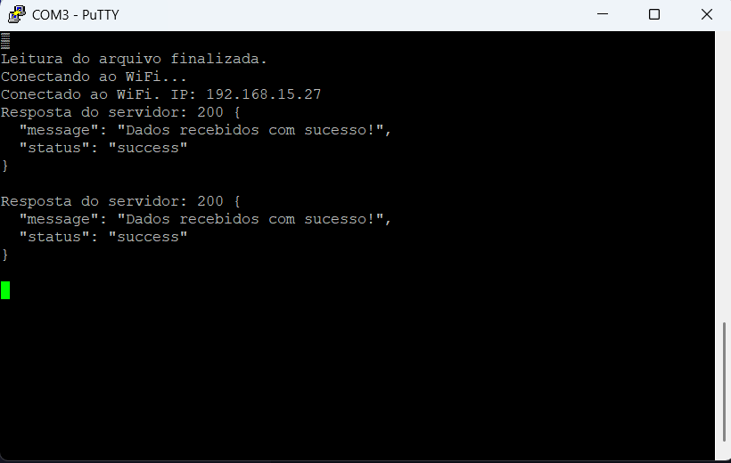
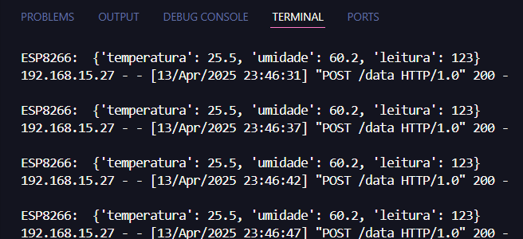

# IoT-flask-esp8266

[](https://shields.io/)
[](https://www.python.org/)
[](https://micropython.org/)
[](https://opensource.org/licenses/MIT)

## Descrição

Esse projeto tem como objetivo colocar em prática os conceitos básicos de Iot aprendidos em sala pelo professor [Vítor E. Andrade](https://github.com/vitorpq), na matéria de Aplicações de Cloud, Iot, Industria 4.0 em Python. O cliente (ESP8266), envia dados, como por exemplo, temperatura, umidade e leitura e os envia para o servidor (Flask) via protocolo HTTP.

## Tecnologias Utilizadas

* [Python 3.12.5](https://www.python.org/)
* [Flask 3.1.0](https://flask.palletsprojects.com/en/3.1.0/)
* [ESP8266](https://www.espressif.com/en/products/socs/esp8266)
* [MicroPython v1.24](https://micropython.org/resources/firmware/ESP8266_GENERIC-20241129-v1.24.1.bin)
* [PuTTy](https://www.chiark.greenend.org.uk/~sgtatham/putty/latest.html)
* `python-dotenv` (para o servidor Flask)
* `urequests` (para o cliente ESP8266)
* `network` (para o cliente ESP8266)
* `machine` (para o cliente ESP8266)
* `json` (para ambos)

## Pré-requisitos

Liste o que é necessário para executar o projeto. Isso pode incluir:

* Instalação do Python.
* Instalação do Flask via `pip install -r requirements.txt`.
* Configuração do ambiente MicroPython no ESP8266 (já está presente no diretório cliente)
* Instalação da ferramenta `ampy` (`pip install adafruit-ampy`).
* Conexão física do ESP8266 ao computador via USB.
* Rede Wi-Fi disponível.

## Instalação e Uso

### Servidor Flask

1.  Clone este repositório: `git clone https://github.com/tupiribas/iot-flask-esp8266`
2.  Navegue até a pasta do servidor: `cd servidor`
3.  Crie um ambiente virtual (recomendado): `python -m venv venv`
4.  Ative o ambiente virtual:
    * No Linux/macOS: `source venv/bin/activate`
    * No Windows: `venv\Scripts\activate`
5.  Instale as dependências: `pip install -r requirements.txt`
6.  Renomeie e edite o arquivo `.env-exemplo` para `.env` para na raiz da pasta `servidor` e configure as variáveis de ambiente (ex: `SERVER_IP`, `SERVER_PORT`).
7.  Execute o servidor Flask: `python servidor.py`.

**Resposta esperada:**
```
(venv) PS C:\iot-flask-esp8266\servidor> py servidor.py  
 * Serving Flask app 'servidor'
 * Debug mode: on
WARNING: This is a development server. Do not use it in a production deployment. Use a production WSGI server instead.
 * Running on http://ip_sua_maquina:sua_porta
Press CTRL+C to quit
 * Restarting with stat
 * Debugger is active!
 * Debugger PIN: 375-644-265
```

### Cliente ESP8266

1.  Certifique-se de ter o firmware MicroPython flashado no seu ESP8266: [ESP8266_GENERIC-20241129-v1.24.1.bin](https://github.com/tupiribas/iot-flask-esp8266/cliente/ESP8266_GENERIC-20241129-v1.24.1.bin)
2.  Instale o [drive que converge USB para serial UART
](https://github.com/tupiribas/iot-flask-esp8266/cliente/ESP8266_GENERIC-20241129-v1.24.1.bin) 
3.  Navegue até a pasta do cliente: `cd cliente`
4.  Crie um ambiente virtual (recomendado): `python -m venv venv`
5.  Ative o ambiente virtual:
    * No Linux/macOS: `source venv/bin/activate`
    * No Windows: `venv\Scripts\activate`
6.  Instale as dependências: `pip install -r requirements.txt`
7.  Edite arquivo `config-exemplo.txt` para `config.txt` e configure as credenciais da sua rede Wi-Fi (`WIFI_SSID`, `WIFI_PASSWORD`) e o endereço do servidor Flask (`SERVER_IP` e `SERVER_PORT`).
8.  Rode esses dois comandos no terminal: o primeiro serve para remover o firmware do ESP8266 e o segundo serve para instalar o MicroPython nele:
    ```bash
    esptool --port <COM3, COM2, etc> erase_flash
    ```
    ```bash
    esptool  --port <COM3, COM2, etc>  write_flash -fm dout --flash_size=detect 0 ESP8266_GENERIC-20241129-v1.24.1.bin.bin
    ```
9.  Envie os arquivos para o ESP8266 usando `ampy`:
    ```bash
    ampy --port <COM3, COM2, etc> put main.py
    ampy --port <COM3, COM2, etc> put config.txt
    ```
    (Substitua `COM3` pela porta serial correta do seu ESP8266).
10.  Monitore a saída serial do ESP8266 usando um terminal serial (PuTTY) configurado para 115200 bps para verificar a conexão Wi-Fi e o envio de dados.

## Uso

* O ESP8266 tentará se conectar à rede Wi-Fi configurada e enviará dados periodicamente (5 sec.) para o servidor Flask.
* O servidor Flask receberá os dados e os imprimirá no terminal.

Caso você queira modificar e implementar o novo programa no ESP8266 você deve executar esses dois comandos no terminal da pasta `.\cliente`:    
```
ampy --port <COM3, COM2, etc> rm main.py
ampy --port <COM3, COM2, etc> put main.py
```
O primeiro comando remove o arquivo implantado anteriormente e o segundo envia para o Node, o novo comando contido no arquivo `main.py`. **Isso vale para qualquer arquivo (main.py, config.txt e etc).**

## Exemplos de Dados

### Cliente:
Imagem de exemplo, lado do cliente:


### Servidor:
Imagem de exemplo, lado do servidor:
